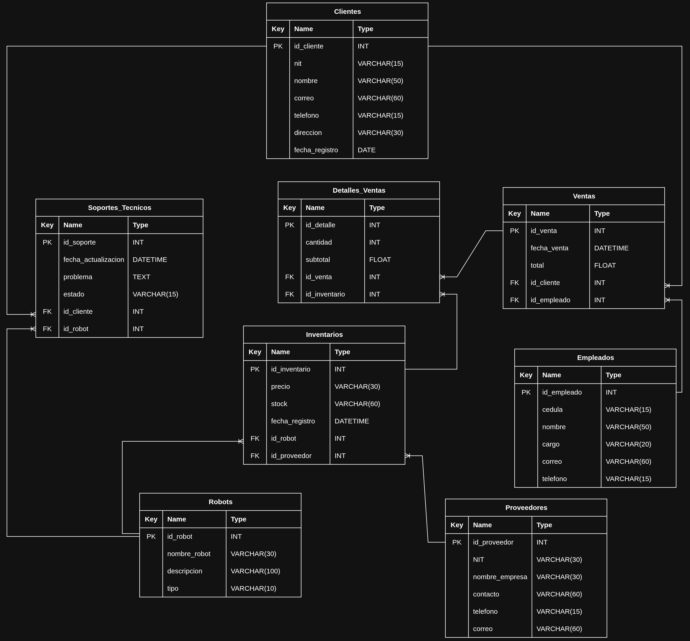

# 🚀 SmartBot Solutions - Sistema de Gestión para Venta y Soporte de Robots

  
  

## 📌 Introducción

**SmartBot Solutions** es una empresa tecnológica dedicada a la venta, distribución y soporte técnico de robots inteligentes para hogares, empresas e instituciones educativas.

Con el crecimiento de la empresa, surge la necesidad de implementar un sistema organizado que permita gestionar clientes, inventario, ventas y soporte técnico de manera eficiente.  
El presente proyecto propone el diseño de una **base de datos relacional** capaz de centralizar toda la información de la compañía mediante formularios digitales y estructuras organizadas de almacenamiento de datos.

## ❗ Planteamiento del Problema

Actualmente la empresa maneja parte de la información de manera manual y dispersa, generando dificultades en el control de inventario, seguimiento de ventas y gestión de soporte técnico. Entre los principales problemas identificados se encuentran:

- Duplicidad de registros.
- Errores en el control de stock.
- Dificultad para consultar información histórica.
- Desorganización de clientes y proveedores.
- Falta de trazabilidad en solicitudes de soporte técnico.

Por ello se propone el desarrollo de una base de datos relacional que permita optimizar la administración de la información.

## 🎯 Objetivos

### Objetivo General
Diseñar una base de datos relacional para SmartBot Solutions que permita gestionar clientes, inventario, ventas y soporte técnico de manera organizada, eficiente y escalable.

### Objetivos Específicos
- Diseñar tablas estructuradas para almacenar información.
- Establecer relaciones entre entidades.
- Crear formularios para el ingreso de datos.
- Controlar el inventario de robots.
- Registrar ventas y clientes.
- Gestionar soporte técnico y mantenimientos.
- Facilitar consultas y reportes administrativos.

## 📐 Alcance del Proyecto

El sistema permitirá:

- Registrar clientes.
- Registrar robots disponibles.
- Administrar proveedores.
- Gestionar ventas.
- Registrar empleados.
- Controlar inventario.
- Registrar solicitudes de soporte técnico.

## ⚙️ Requerimientos del Sistema

### Requerimientos Funcionales
- Registrar nuevos clientes.
- Registrar robots en inventario.
- Actualizar el stock de productos.
- Registrar ventas.
- Relacionar clientes con compras realizadas.
- Registrar proveedores.
- Registrar empleados.
- Registrar solicitudes de soporte técnico.
- Consultar historial de ventas.
- Consultar robots con bajo stock.

### Requerimientos No Funcionales
- Fácil de usar.
- Organizado y estructurado.
- Escalable para futuras mejoras.
- Rápido en consultas básicas.
- Capaz de evitar duplicidad de información.

## 🗃️ Diseño de la Base de Datos

### Tabla 1: Clientes
| Campo            | Tipo de dato | Descripción                       |
|------------------|--------------|-----------------------------------|
| id_cliente       | INT          | Identificador único del cliente   |
| nombre           | VARCHAR      | Nombre completo                   |
| correo           | VARCHAR      | Correo electrónico                |
| telefono         | VARCHAR      | Número telefónico                 |
| direccion        | VARCHAR      | Dirección de residencia           |
| fecha_registro   | DATE         | Fecha de registro                 |

### Tabla 2: Robots
| Campo            | Tipo de dato | Descripción                       |
|------------------|--------------|-----------------------------------|
| id_robot         | INT          | Identificador único               |
| nombre           | VARCHAR      | Nombre del robot                  |
| descripcion      | VARCHAR      | Descripción del robot             |
| tipo             | VARCHAR      | Nombre de la categoría            |

### Tabla 3: Proveedores
| Campo            | Tipo de dato | Descripción                       |
|------------------|--------------|-----------------------------------|
| id_proveedor     | INT          | Identificador único               |
| nombre_empresa   | VARCHAR      | Nombre del proveedor              |
| contacto         | VARCHAR      | Persona de contacto               |
| telefono         | VARCHAR      | Número telefónico                 |
| correo           | VARCHAR      | Correo empresarial                |

### Tabla 4: Inventarios
| Campo            | Tipo de dato | Descripción                       |
|------------------|--------------|-----------------------------------|
| id_inventario    | INT          | Identificador del inventario      |
| precio           | DECIMAL      | Precio de venta                   |
| stock            | INT          | Cantidad disponible               |
| fecha_registro   | DATETIME     | Fecha de ingreso de robots        |
| id_proveedor     | INT          | Proveedor asociado (FK)           |
| id_robot         | INT          | Robot asociado (FK)               |

### Tabla 5: Empleados
| Campo            | Tipo de dato | Descripción                       |
|------------------|--------------|-----------------------------------|
| id_empleado      | INT          | Identificador                     |
| nombre           | VARCHAR      | Nombre del empleado               |
| cargo            | VARCHAR      | Cargo laboral                     |
| correo           | VARCHAR      | Correo corporativo                |
| telefono         | VARCHAR      | Número de contacto                |

### Tabla 6: Ventas
| Campo            | Tipo de dato | Descripción                       |
|------------------|--------------|-----------------------------------|
| id_venta         | INT          | Identificador de venta            |
| fecha_venta      | DATETIME     | Fecha de compra                   |
| total            | DECIMAL      | Valor total                       |
| id_cliente       | INT          | Cliente asociado (FK)             |
| id_empleado      | INT          | Empleado responsable (FK)         |

### Tabla 7: Detalle_Venta
| Campo            | Tipo de dato | Descripción                       |
|------------------|--------------|-----------------------------------|
| id_detalle       | INT          | Identificador                     |
| id_venta         | INT          | Venta relacionada (FK)            |
| id_inventario    | INT          | Robot vendido desde inventario (FK) |
| cantidad         | INT          | Cantidad comprada                 |
| subtotal         | DECIMAL      | Valor parcial                     |

### Tabla 8: Soporte_Tecnico
| Campo            | Tipo de dato | Descripción                       |
|------------------|--------------|-----------------------------------|
| id_soporte       | INT          | Identificador                     |
| fecha_reporte    | DATETIME     | Fecha del reporte                 |
| problema         | TEXT         | Descripción de la falla           |
| estado           | VARCHAR      | Estado del caso                   |
| id_cliente       | INT          | Cliente asociado (FK)             |
| id_robot         | INT          | Robot relacionado (FK)            |

## 🔗 Relaciones Entre Tablas

- Un **cliente** puede realizar muchas **ventas** (1:N).
- Un **empleado** puede registrar muchas **ventas** (1:N).
- Un **proveedor** puede suministrar muchos **robots** (1:N).
- Una **venta** puede contener varios **robots** (N:M a través de Detalle_Venta).
- Un **robot** puede aparecer en múltiples **ventas** (N:M a través de Detalle_Venta).
- Un **cliente** puede generar múltiples **solicitudes de soporte** (1:N).
- Un **robot** puede tener varios **registros de soporte técnico** (1:N).

## 📊 Modelo Relacional

- Clientes **(1:N)** Ventas
- Empleados **(1:N)** Ventas
- Ventas **(1:N)** Detalle_Venta
- Robots **(1:N)** Detalle_Venta
- Proveedores **(1:N)** Robots
- Clientes **(1:N)** Soporte_Tecnico
- Robots **(1:N)** Soporte_Tecnico

### Diagrama del modelo relacional

## 📝 Formularios del Sistema

### Clientes
- Nombre
- Correo
- Teléfono
- Dirección

### Robots
- Nombre del robot
- Categoría
- Precio
- Stock
- Proveedor

### Ventas
- Cliente
- Robot
- Cantidad
- Total
- Empleado

### Soporte Técnico
- Cliente
- Robot
- Problema reportado
- Estado del caso

## 📌 Conclusiones

La implementación de esta base de datos permitirá a **SmartBot Solutions** mejorar la organización y administración de su información empresarial.  
Además, facilitará la gestión de inventario, ventas y soporte técnico mediante una estructura relacional eficiente, demostrando la aplicación práctica de conceptos fundamentales de diseño de bases de datos.

---

📄 *Documentación del proyecto final - Diseño de Base de Datos*  
👥 **Autores:** Juan José Ochoa Romero, Michael Yesid Baquero Gómez, Ingrid Liseth Roa Manrique  
🏫 **Institución:** Fundación Universitaria Cafam - Unicafam  
📅 **Fecha:** 09 de mayo de 2026